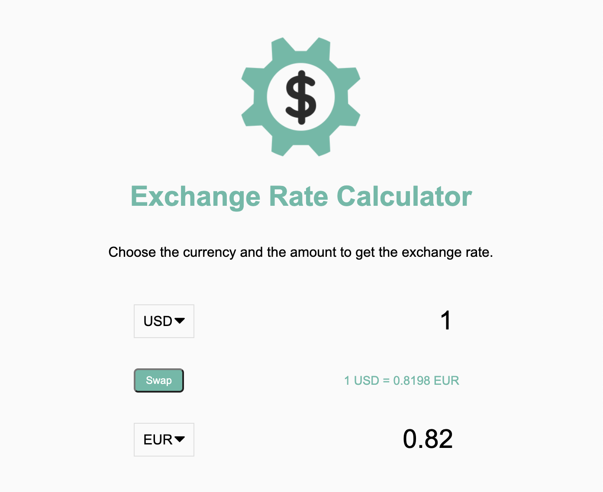

# Exchange-Rate-Calculator

### This is a simple exchange rate calculator. I built it using HTML, CSS and javascript. The data was retrieved using the ExchangeRate-API.com API. The user can select any currency type and amount and convert it into whatever currency type they choose. There is also a swap button that switches the positons of the two currency types.

## Here is an image of the functioning application

## Here is a link to try the app out yourself!
https://gtj82.github.io/Exchange-Rate-Calculator/
